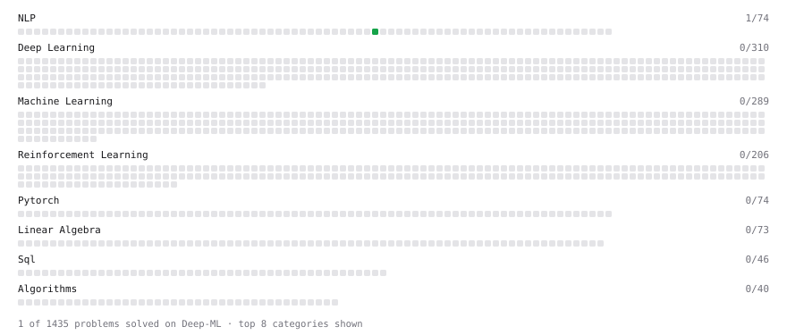

# Deep-ML

My machine learning practice from [Deep-ML](https://www.deep-ml.com). Every solution here was written by hand.

**2** solved · 2 problems · 0 labs · 0 math

[**Browse the interactive portfolio**](https://harsha-chichu.github.io/deep-ml/) to replay this filling in over time.

## Problems

| | Difficulty | Solved | |
| --- | --- | --- | --- |
| [Calculate Vocabulary Size from Token List](https://www.deep-ml.com/problems/953) | easy | 2026-09-22 | [solution](problems/0953-calculate-vocabulary-size-from-token-list) |
| [Tokenizer with Unknown and End-of-Text Tokens](https://www.deep-ml.com/problems/943) | easy | 2026-09-22 | [solution](problems/0943-tokenizer-with-unknown-and-end-of-text-tokens) |

---

_This file is regenerated by Deep-ML on every push._
